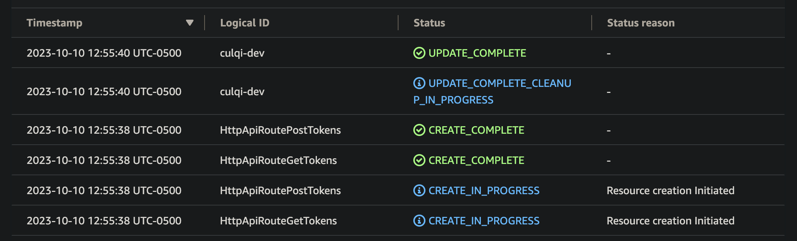

# Culqi Backend Lambda App

### Configuración inicial - Comandos a ejecutar

Clonar el repositorio para empezar a utilizar la aplicación. Hay que tener instalado [Nodejs](https://nodejs.org/en) y [Serverless](https://www.npmjs.com/package/serverless) de manera global si se quiere probar en local:

```
npm install -g serverless
```

Una vez completada la instalación ingresar a la carpeta y ejecutar el comando:

```
npm install
```

##### El package.json del proyecto cuenta con los siguientes comandos:

1. Comando para compilar TypeScript y generar el build de la aplicación:
   ```
   npm start
   ```
2. Comando para ejecutar los test de la aplicación en un entorno local:
   ```
   npm test
   ```
3. Comando para ejecutar la aplicación en un entorno local:
   ```
   npm run local
   ```

### Documentación Postman

https://documenter.getpostman.com/view/3273833/2s9YJhy1Gs

---

### Pruebas en desarrollo


---

### Despliegue en AWS



#### Endpoints:

##### POST: https://651v0emplk.execute-api.sa-east-1.amazonaws.com/tokens

##### GET: https://651v0emplk.execute-api.sa-east-1.amazonaws.com/tokens

#### Functions:

     generarToken: culqi-dev-generarToken (10 MB)

     procesarCargo: culqi-dev-procesarCargo (10 MB)
