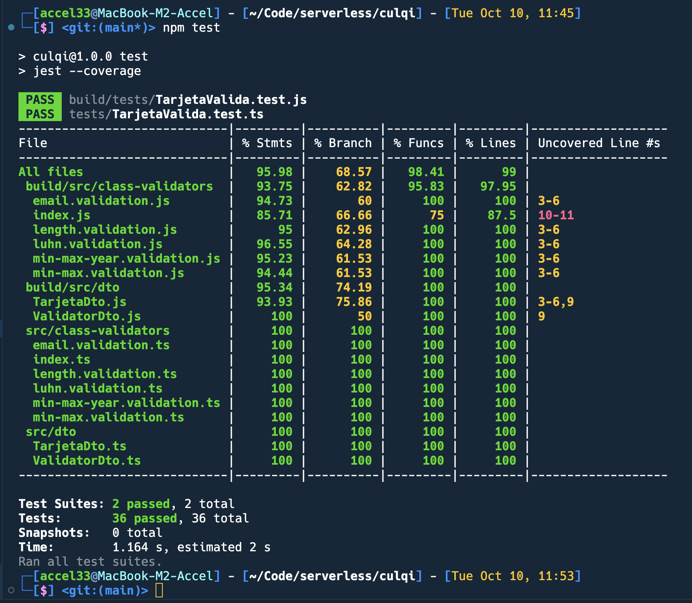

# Culqi Backend Lambda App

Para empezar a utilizar la aplicacion hay que tener instalado [Nodejs](https://nodejs.org/en) en la maquina ejecutando esta aplicacion. Luego correr el siguiente comando dentro de la carpeta:

```
npm install
```

El package.json del proyecto tiene 2 comandos:

1. Comando para compilar TypeScript y generar el build de la aplicación:
   ```
   npm start
   ```
2. Comando para ejecutar los test de la aplicación en un entorno local:
   ```
   npm test
   ```

### Documentacion Postman

https://documenter.getpostman.com/view/3273833/2s9YJhy1Gs

---

### Pruebas de desarrollo


